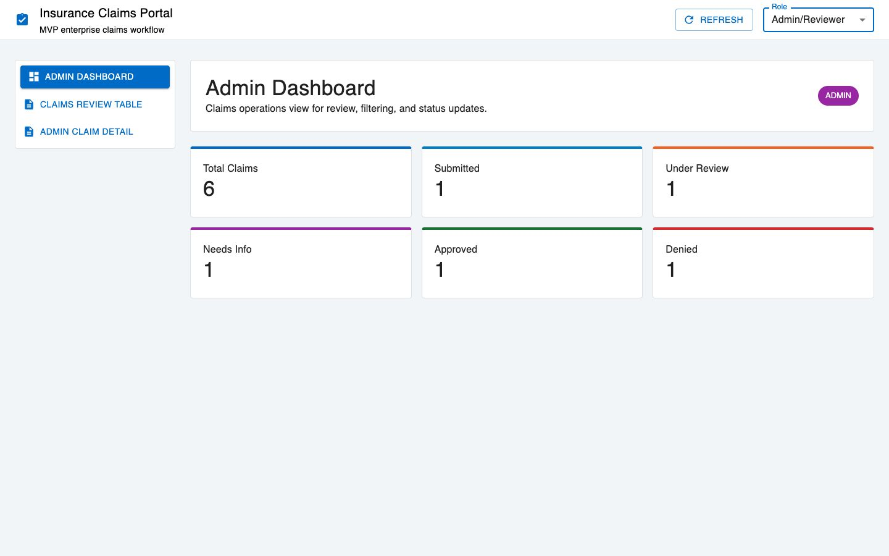
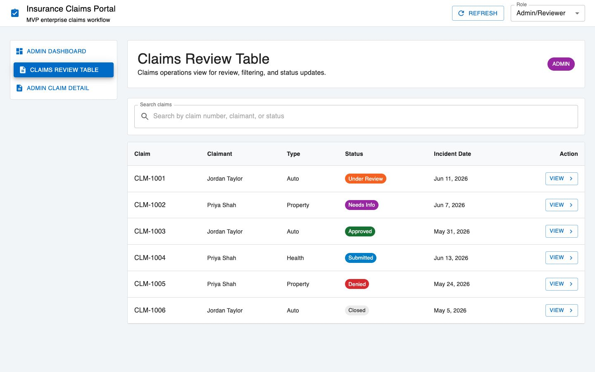
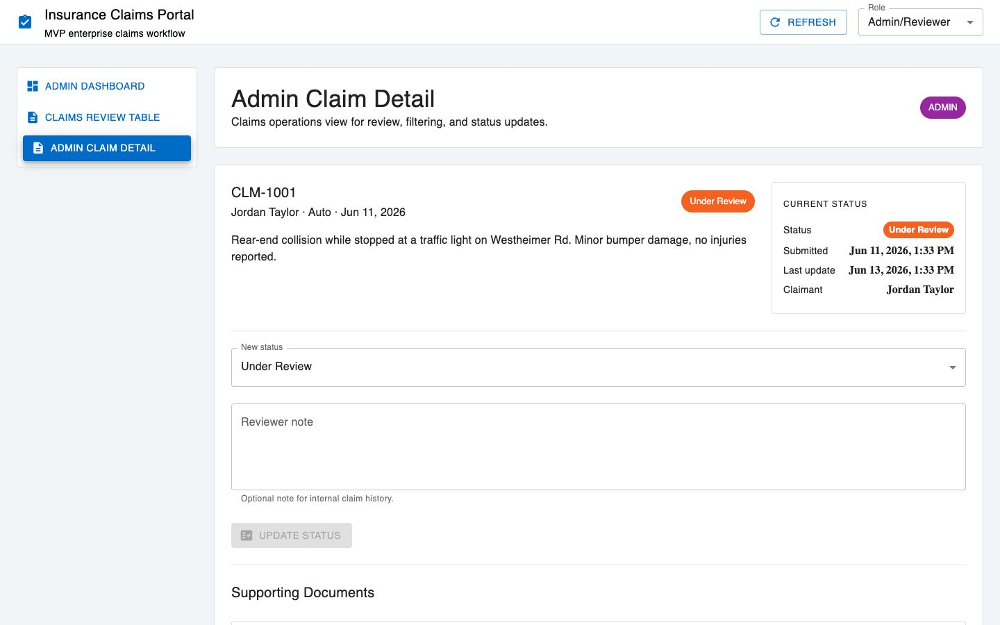
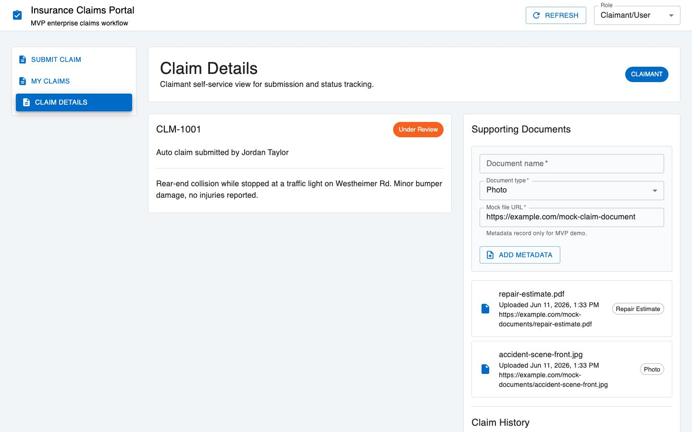
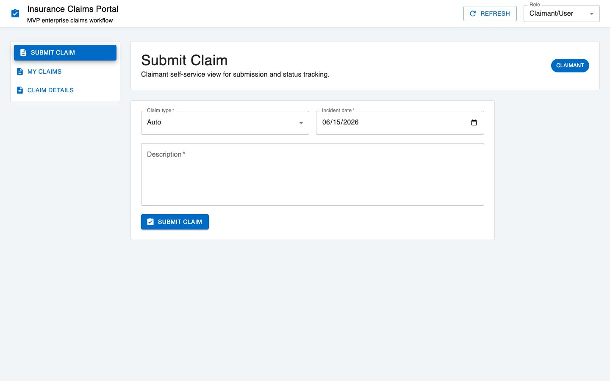
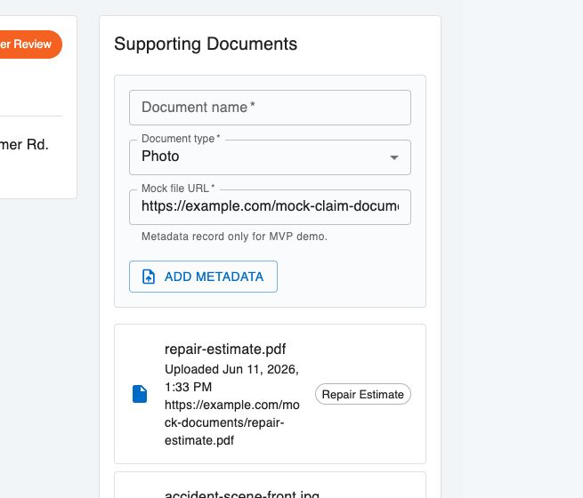
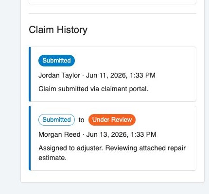

# Insurance Claims Management Portal

A full-stack insurance claims workflow application built with Spring Boot, PostgreSQL, React, REST APIs, and Material UI to demonstrate enterprise workflow design, claim submission, admin review, status tracking, audit history, document metadata, and dashboard visibility.


## Project Overview

This project models a portfolio-sized insurance claims portal with two main experiences:

- A claimant/user can submit claims, view status, review details, and attach supporting document metadata.
- An admin/claims reviewer can review claims, update claim status, add reviewer notes, and view audit history.

The goal is not to build a production insurance platform. The goal is to show business systems thinking, enterprise workflow awareness, API/database credibility, and practical technical execution.

## Why This Project Matters

Insurance claims are workflow-heavy business processes. A real enterprise claims system needs structured intake, review visibility, status tracking, supporting documentation, and a reliable audit trail.

This MVP demonstrates:

- Structured claim intake so users provide consistent claim information
- Admin review workflow so claims can move through operational statuses
- Status tracking so users and reviewers understand where a claim stands
- Audit history so status changes are traceable
- Dashboard visibility so admins can monitor claim volume and workflow state
- Separation of claimant and admin experiences so each role sees the right tasks

That makes the project relevant to Business Systems Analyst, Product Analyst, Solutions Analyst, Technology Analyst, Digital Transformation Analyst, and Risk Technology Analyst roles.

## Screenshots

### Admin Dashboard



### Admin Claims Review Table



### Admin Claim Detail / Status Update



### Claimant Claim Details



### Claimant Submit Claim



### Supporting Documents



### Claim History / Audit Trail



## Features

- Submit a new insurance claim
- View claimant-specific claims
- View claim details
- View admin claims review table
- Update claim status as an admin reviewer
- Require reviewer notes for selected status changes
- Prevent invalid status updates
- Track claim history/audit trail
- View dashboard summary metrics
- Add and view supporting document metadata
- Use mock role switching for MVP claimant/admin workflows

## Tech Stack

- Backend: Java, Spring Boot
- Database: PostgreSQL
- ORM/Data Access: Spring Data JPA
- API: REST APIs
- Frontend: React, Vite
- UI: Material UI
- Validation: Jakarta Bean Validation and backend workflow checks
- Version Control: Git and GitHub

## User Roles

### Claimant/User

The claimant can submit claims, view their claims, inspect status, review claim history, and add supporting document metadata.

### Admin/Claims Reviewer

The admin can view all claims, open claim details, update claim status, add reviewer notes, review supporting documents, and monitor dashboard counts.

Authentication is intentionally mocked for the MVP. The role switcher exists to demonstrate separate user experiences without adding JWT or account management yet.

## Core Workflow

1. Claimant submits a claim.
2. Backend stores the claim in PostgreSQL with status `SUBMITTED`.
3. Backend creates an initial claim history record.
4. Admin opens the claims review table.
5. Admin opens a claim detail screen.
6. Admin updates the claim status and adds a reviewer note.
7. Backend updates the claim and writes a new history entry.
8. Frontend refreshes claim details, dashboard counts, and claim history.

## Status Values

- `SUBMITTED`
- `UNDER_REVIEW`
- `NEEDS_INFO`
- `APPROVED`
- `DENIED`
- `CLOSED`

## API Endpoint Summary

| Method | Endpoint | Purpose |
| --- | --- | --- |
| `GET` | `/api/users` | Get seeded MVP users |
| `GET` | `/api/claims` | Get all claims |
| `POST` | `/api/claims` | Submit a new claim |
| `GET` | `/api/claims/{id}` | Get claim details |
| `PATCH` | `/api/claims/{id}/status` | Update claim status |
| `GET` | `/api/claims/{id}/history` | Get claim audit history |
| `GET` | `/api/claims/{id}/documents` | Get document metadata |
| `POST` | `/api/claims/{id}/documents` | Add document metadata |
| `GET` | `/api/dashboard/summary` | Get admin dashboard counts |

## Database / Entity Summary

- `User`: seeded claimant/admin users for MVP role switching
- `Claim`: core claim record with type, description, incident date, status, and claimant
- `ClaimHistory`: audit trail for claim submission and status updates
- `Document`: supporting document metadata only, including file name, document type, mock URL, uploader, and upload date

## Local Setup

### Prerequisites

- Java 21
- Maven or the included Maven wrapper
- Node.js and npm
- PostgreSQL 16

### Start PostgreSQL

```bash
brew services start postgresql@16
```

Create the database if needed:

```bash
createdb insurance_claims
```

### Run Backend

```bash
cd backend
./mvnw spring-boot:run
```

Backend runs at:

```text
http://localhost:8080
```

### Run Frontend

```bash
cd frontend
npm install
npm run dev -- --host 127.0.0.1
```

Frontend runs at:

```text
http://127.0.0.1:5173
```

## Useful Local API Checks

```bash
curl http://localhost:8080/api/users
curl http://localhost:8080/api/claims
curl http://localhost:8080/api/dashboard/summary
curl http://localhost:8080/api/claims/1/history
curl http://localhost:8080/api/claims/1/documents
```

## Demo Script

Use this walkthrough for a short portfolio demo:

1. Open the React frontend at `http://127.0.0.1:5173`.
2. Start as `Claimant/User`.
3. Open `Submit Claim` and explain the structured intake form.
4. Open `Claim Details` and show claim status, supporting documents, and audit history.
5. Switch to `Admin/Reviewer`.
6. Open `Admin Dashboard` and explain the operational counts.
7. Open `Claims Review Table` and point out search, status chips, and claimant context.
8. Open `Admin Claim Detail`.
9. Show the current status summary, submitted date, last update, claimant, next status dropdown, and reviewer note.
10. Explain that status changes refresh the claim, dashboard counts, and audit trail.

## Screenshot Checklist

See [docs/screenshot-checklist.md](docs/screenshot-checklist.md) for the full portfolio capture checklist.

## Planning Documentation

- [User roles](docs/planning/user-roles.md)
- [Core entities](docs/planning/entities.md)
- [API endpoint plan](docs/planning/api-endpoints.md)
- [UI screens](docs/planning/ui-screens.md)
- [Architecture overview](docs/planning/architecture-overview.md)

## Test Commands

### Frontend

```bash
cd frontend
npm run lint
npm run build
```

### Backend

```bash
cd backend
./mvnw test -q
```

## MVP Limitations

- No JWT authentication yet
- No production user registration/login
- No real file upload or cloud storage
- No document preview
- No payment, settlement, or policy administration logic
- No advanced reporting or analytics
- No external insurance carrier integrations
- No production deployment configuration yet

## Future Improvements

- Add simple authentication and role-based access control
- Add real file upload with secure storage
- Add automated backend service tests for claim status transitions
- Add frontend integration tests
- Add dashboard charts and operational reporting
- Add deployment documentation
- Add a final portfolio case study writeup

## Portfolio Positioning

This project shows how an insurance workflow can be translated into a digital business system. It demonstrates the connection between business process, data modeling, REST APIs, administrative review, user experience, and operational visibility.
